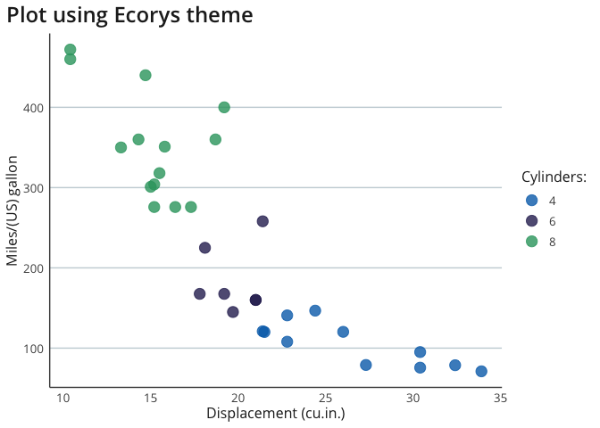

<!-- README.md is generated from README.Rmd. Please edit that file -->

# ecorys R package

`ecorys` is a package of tools for working with R at Ecorys. It is
currently under development and will likely be updated with new
functions in the future.

## Installation and updating

You can install the latest version of `ecorys` by running the following
code in your R console. If you have already installed `ecorys` and want
to update the package to the latest version, you can also use the
following code.

``` r
if (!require(devtools)) {
    install.packages('devtools')
}
devtools::install_github("j-lillis/ecorys")
```

## Features

Currently `ecorys` provides the following tools which are designed to
make it easy to format `ggplot2` plots in Ecorys branding:

-   `theme_ecorys()` - add this to your plot to format it in Ecorys
    style

-   `ecorys_colours` - a list of Ecorys brand colours. Use `$` to access
    individual colours, e.g. `ecorys_colours$blue`

-   `ecorys_palettes` - a list of palettes, each composed of Ecorys
    brand colours. Use `$` to access palettes,
    e.g. `ecorys_palettes$primary`

`ecorys` is also being updated with functions to support wrangling and
cleaning data. Currently it contains the following function:

-   `fct_case_when()` - an extension of `dplyr::case_when` which outputs
    right hand side values as factors, where the order of resulting
    factor levels reflects the order in which arguments to the function
    are specified.

## Examples

``` r
mtcars %>% 
  ggplot(aes(x = mpg, y = disp, colour = factor(cyl))) +
  geom_point(size = 4, alpha = 0.8) +
  scale_colour_manual(values = c(ecorys_colours$blue, 
                                 ecorys_colours$purple, 
                                 ecorys_colours$green),
                      name = "Cylinders:") +
  labs(title = "Plot using Ecorys theme") +
  ylab("Miles/(US) gallon") +
  xlab("Displacement (cu.in.)") +
  theme_ecorys(y_grid = TRUE)
```



## 
