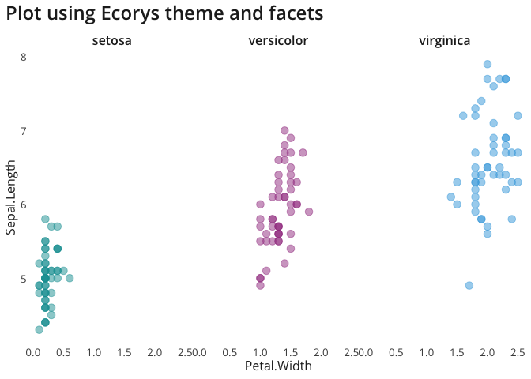

<!-- README.md is generated from README.Rmd. Please edit that file -->

# ecorys R package

`ecorys` is a package of tools for working with R at Ecorys. It is
currently under development and will likely be updated with new
functions in the future.

## Installation and updating

You can install `ecorys` by running the following code in your R
console:

``` r
if (!require(devtools)) {
    install.packages('devtools')
}
devtools::install_github("j-lillis/ecorys")
```

If you have already installed `ecorys`, you can also use the above code
to update it to the latest version. You can check what version of the
package is currently installed by running `packageVersion('ecorys')` in
your R console.

## Features

Currently `ecorys` provides the following tools which are designed to
make it easy to format `ggplot2` plots in Ecorys branding:

-   `theme_ecorys()` - add this to your plot to format it in Ecorys
    style

-   `ecorys_colours` - a list of Ecorys brand colours. Use `$` to access
    individual colours, e.g. `ecorys_colours$blue`

-   `ecorys_palettes` - a list of palettes, each composed of Ecorys
    brand colours. Use `$` to access palettes,
    e.g. `ecorys_palettes$primary`

-   `ecorys_mono_pal()` - a function which return a monochrome blue
    palette of however many shades you specify,
    e.g. `ecorys_mono_pal(4)`

`ecorys` is also being updated with functions to support wrangling and
cleaning data. Currently it contains the following function:

-   `fct_case_when()` - an extension of `dplyr::case_when` which outputs
    right hand side values as factors, where the order of resulting
    factor levels reflects the order in which arguments to the function
    are specified.

## Examples

Using `theme_ecorys()` and accessing colours from `ecorys_colours`.

Note the arguments specified to `theme_ecorys()` to display y-axis grid
lines and main axis lines.

``` r
data(mtcars)

mtcars %>% 
  ggplot(aes(x = mpg, y = disp, colour = factor(cyl))) +
  geom_point(size = 4, alpha = 0.8) +
  scale_colour_manual(values = c(ecorys_colours$blue, 
                                 ecorys_colours$purple, 
                                 ecorys_colours$green),
                      name = "Cylinders:") +
  labs(title = "Plot using Ecorys theme") +
  ylab("Miles/(US) gallon") +
  xlab("Displacement (cu.in.)") +
  theme_ecorys(grid.major.y = TRUE,
               axis.line = TRUE)
```


As above, but using `facet_wrap()`. Note that within `theme_ecorys()`,
`strip.background = FALSE` to remove the default boxes surrounding facet
titles.

``` r
data(iris)

iris %>% 
  ggplot(aes(x = Sepal.Length, y = Petal.Width,
             colour = Species)) +
  geom_point(size = 3, alpha = 0.5) +
  scale_colour_manual(values = c(ecorys_colours$jade, 
                                 ecorys_colours$magenta, 
                                 ecorys_colours$light_blue)) +
  facet_wrap(~Species) +
  coord_flip() +
  labs(title = "Plot using Ecorys theme and facets") +
  theme_ecorys(strip.background = FALSE) +
  theme(legend.position = "none")
```



``` r
data(diamonds)

diamonds %>% 
  ggplot() + 
  geom_bar(mapping = aes(x = cut, fill = clarity), position = "dodge") +
  scale_fill_manual(values = ecorys_mono_pal(length(unique(diamonds$clarity))),
                    name = "Clarity") +
  labs(title = "Plot using monochrome blue Ecorys palette") +
  ylab("Count") +
  xlab("Cut") +
  theme_ecorys(grid.major.y = TRUE)
```


